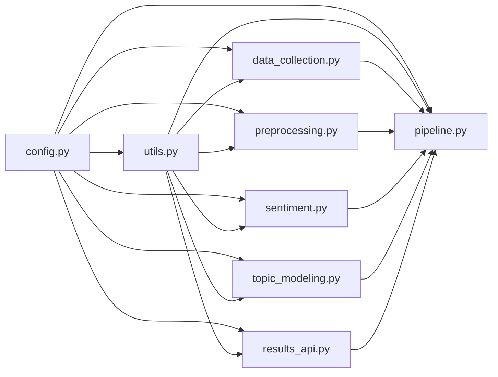

# Architecture Diagram — World Cup 2026 Sentiment Analysis

## Pipeline Architecture

```mermaid
graph TB
    subgraph "1. Data Collection"
        A1[YouTube Data<br/>API v3] --> A2[data_collection.py]
        A2 -->|Quota-tracked, checkpointed| A3[(data/raw/<br/>youtube_comments.parquet)]
    end

    subgraph "2. Preprocessing"
        B1[(raw comments)] --> B2[preprocessing.py]
        B2 -->|Clean, detect language, deduplicate| B3[(data/processed/<br/>preprocessed.parquet)]
    end

    subgraph "3. Sentiment Analysis"
        C1[(clean text)] --> C2[sentiment.py]
        C2 -->|pysentimiento ES / RoBERTa EN| C3[(data/processed/<br/>sentiment.parquet)]
        C2 -->|VADER EN / lexicon ES| C4[(data/processed/<br/>baseline)]
    end

    subgraph "4. Topic Modeling & NER"
        D1[(clean text)] --> D2[topic_modeling.py]
        D2 -->|BERTopic| D3[(data/processed/<br/>topic_ner.parquet)]
        D2 -->|spaCy NER + custom dict| D3
    end

    subgraph "5. Match Integration"
        E1[football-data.org<br/>API] --> E2[results_api.py]
        E2 -->|24h windows, Mann-Whitney| E3[(data/processed/<br/>sentiment_shift.parquet)]
        D3 --> E2
    end

    subgraph "6. Pipeline Orchestration"
        F1[pipeline.py] -->|config-driven, reversible steps| A2
        F1 --> B2
        F1 --> C2
        F1 --> D2
        F1 --> E2
        F1 --> F2[(data/processed/<br/>final.parquet)]
    end

    subgraph "7. Dashboard"
        G1[dashboard/app.py] -->|Streamlit + Plotly| G2[5 interactive tabs]
        G1 -->|@st.cache_data| F2
        G2 --> G3[Resumen Ejecutivo]
        G2 --> G4[Evolución Temporal]
        G2 --> G5[Comparativa Equipos]
        G2 --> G6[Temas]
        G2 --> G7[Impacto Partidos]
    end

    subgraph "8. Evaluation"
        H1[evaluation/<br/>evaluate_models.py] -->|Generate template, compute metrics| H2[(manual_labels.csv)]
        H1 -->|Error analysis| H3[Accuracy / F1 / Confusion Matrix]
    end

    subgraph "9. Tests"
        I1[tests/<br/>test_preprocessing.py] --> I2[pytest]
        I1[tests/<br/>test_sentiment.py] --> I2
    end
```

## Module Dependency Graph



## Data Flow Summary

```
YouTube ──► raw/ ──► preprocessed/ ──► sentiment/ ──► topic_ner/ ──► final/
  │                 │                    │               │              │
  │                 │                    │               │              └──► Dashboard
  │                 │                    │               │
  │                 │                    │               └── Entities + Topics
  │                 │                    │
  │                 │                    └── Sentiment labels + scores
  │                 │
  │                 └── Cleaned text + language + emojis
  │
  └── Checkpoint system (resumable)

football-data.org ──► fixtures_cache.json ──► sentiment_shift.parquet
```

## Technology Stack Layers

```
┌──────────────────────────────────────────┐
│           Streamlit Dashboard            │  ← Presentation
├──────────────────────────────────────────┤
│              Plotly Charts               │
├──────────────────────────────────────────┤
│        Pipeline Orchestrator             │  ← Application
├──────────────────────────────────────────┤
│     pysentimiento  │  RoBERTa  │  VADER  │  ← ML Models
│     spaCy NER  │  BERTopic  │  HDBSCAN  │
├──────────────────────────────────────────┤
│     pandas  │  numpy  │  scikit-learn    │  ← Data Processing
├──────────────────────────────────────────┤
│  google-api-python-client │  requests  │  dotenv        │  ← Integration
├──────────────────────────────────────────┤
│        Python 3.10+ │  Docker            │  ← Runtime
└──────────────────────────────────────────┘
```

## Configuration

All constants are centralized in `src/config.py`:

| Setting | Description | Change impact |
|---------|-------------|---------------|
| `TARGET_TEAMS` | Teams to track | Add/remove a team |
| `YOUTUBE_CHANNELS` | YouTube channel IDs to search | Add a new source channel |
| `TEAM_KEYWORDS` | Keyword-based team detection | Improve mention accuracy |
| `MATCH_PRE/POST_WINDOW_HOURS` | Causal analysis window | Tighten/widen time window |
| `LANG_DETECT_CONFIDENCE_THRESHOLD` | Language filter strictness | Control precision/recall |
