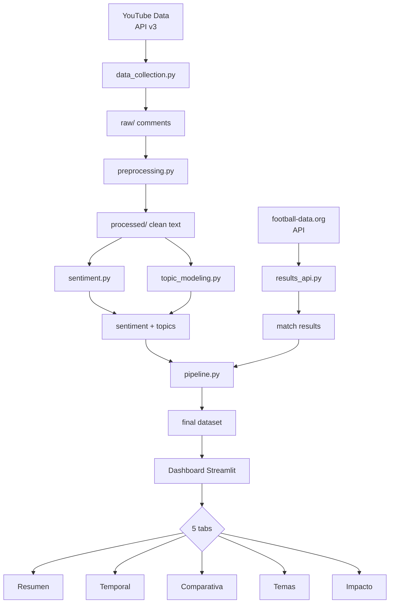

# Mundial 2026 — Social Media Sentiment Analysis

[](https://www.python.org/downloads/)
[](LICENSE)
[](https://github.com/psf/black)
[](https://github.com/astral-sh/ruff)

Analiza cómo evoluciona el sentimiento de los aficionados en YouTube durante el **Mundial de Fútbol 2026** y cómo se relaciona con los resultados deportivos reales. Pipeline completo de NLP: desde la extracción de datos hasta un dashboard interactivo.

---

## Tabla de contenidos

- [Pregunta de negocio](#pregunta-de-negocio)
- [Arquitectura](#arquitectura)
- [Stack tecnológico](#stack-tecnológico)
- [Instalación](#instalación)
- [Uso](#uso)
- [Estructura del repositorio](#estructura-del-repositorio)
- [Metodología](#metodología)
- [Resultados](#resultados)
- [Limitaciones](#limitaciones)
- [Autor](#autor)
- [Licencia](#licencia)

---

## Pregunta de negocio

> **¿Cómo varía el sentimiento del público hacia una selección nacional en función de los resultados deportivos, y qué temas explican esa variación?**

Este proyecto permite a marcas patrocinadoras, federaciones y medios entender:
- Cómo evoluciona la percepción de cada selección durante el torneo.
- Si un resultado (victoria/derrota/polémica arbitral) causa un cambio mensurable en el sentimiento.
- Qué temas específicos (jugadores, árbitros, lesiones, rendimiento) impulsan los picos de sentimiento positivo o negativo.

---

## Arquitectura



**Flujo de datos:**
1. `data_collection` extrae comentarios de YouTube con checkpoint/reanudación y control de cuota de API.
2. `preprocessing` limpia, detecta idioma y deduplica.
3. `sentiment` clasifica (pysentimiento para ES, RoBERTa para EN) con baseline comparativo.
4. `topic_modeling` extrae temas (BERTopic) y entidades (spaCy + diccionario propio).
5. `results_api` obtiene resultados reales de partidos via football-data.org.
6. `pipeline` orquesta todo el proceso y persiste los datos.
7. `dashboard/app.py` visualiza los resultados en 5 pestañas interactivas.

---

## Stack tecnológico

| Componente | Tecnología |
|-----------|-----------|
| Lenguaje | Python 3.10+ |
| Extracción de datos | YouTube Data API v3 |
| NLP | spaCy, pysentimiento, HuggingFace Transformers |
| Sentimiento ES | pysentimiento (BERT fine-tuned español) |
| Sentimiento EN | cardiffnlp/twitter-roberta-base-sentiment |
| Baseline EN | VADER |
| Baseline ES | Léxico de polaridad (NRC-EmoLex ES) |
| Topic Modeling | BERTopic + SentenceTransformers |
| Resultados | football-data.org API |
| Procesamiento | pandas, numpy, scikit-learn |
| Visualización | Streamlit, Plotly |
| Testing | pytest |
| Calidad código | black, ruff, isort, pre-commit |

---

## Instalación

### Requisitos previos
- Python 3.10 o superior
- API key de YouTube Data API v3 ([Google Cloud Console](https://console.cloud.google.com/apis/credentials))
- (Opcional) API key de [football-data.org](https://www.football-data.org/client/register)

### Pasos

```bash
# 1. Clonar
git clone https://github.com/tu-usuario/mundial2026-sentiment-analysis.git
cd mundial2026-sentiment-analysis

# 2. Entorno virtual
python -m venv venv
# Linux/macOS:
source venv/bin/activate
# Windows:
venv\Scripts\activate

# 3. Dependencias
pip install -r requirements.txt

# 4. Modelos de spaCy
python -m spacy download es_core_news_sm
python -m spacy download en_core_web_sm

# 5. Configurar API keys
cp .env.example .env
# Edita .env con tus credenciales
```

O usa el Makefile:
```bash
make setup
```

---

## Uso

### Pipeline completo
```bash
make pipeline
# o
python -m src.pipeline
```

### Pipeline rápido (usando caché)
```bash
make pipeline-quick
# o
python -m src.pipeline --skip-collect
```

### Dashboard interactivo
```bash
make dashboard
# o
streamlit run dashboard/app.py
```

### Tests
```bash
make test
# o
python -m pytest tests/ -v --cov=src
```

### Calidad de código
```bash
make lint      # ruff
make format    # black + isort
```

### Notebooks
Ejecuta los notebooks en orden desde `notebooks/` para explorar cada etapa del pipeline con narrativa detallada.

---

## Security

### API keys and credentials

This project requires two API keys:
- **YouTube Data API v3** — obtain from [Google Cloud Console](https://console.cloud.google.com/apis/credentials)
- **football-data.org** — obtain from [football-data.org/client/register](https://www.football-data.org/client/register)

**Never hardcode secrets in source code.** Credentials are loaded at runtime from:

1. **Environment variables** (used by GitHub Actions when secrets are injected).
2. **``.env`` file** (local development) — this file is in ``.gitignore`` and will never be committed.

The file ``.env.example`` contains **placeholder values only** — never real keys. Copy it to ``.env`` and fill in your actual keys:

```bash
cp .env.example .env
# then edit .env with your real keys
```

### Pre-commit hooks (recommended)

The repository includes ``.pre-commit-config.yaml`` with a ``detect-secrets`` hook that blocks any commit containing strings that look like API keys, tokens, or passwords.

Install pre-commit hooks:

```bash
pip install pre-commit
pre-commit install
```

The first time you commit, ``detect-secrets`` will scan for potential secrets and alert if any are found. To handle known false positives, generate a baseline:

```bash
detect-secrets scan > .secrets.baseline
```

If a real secret is detected, the commit will be **blocked** — remove the secret from the code and use environment variables instead.

### What to do if a secret is committed

If a real API key is ever committed to the repository (even if later removed):

1. **Immediately rotate the key** — generate a new one from the provider's dashboard.
2. **Do not rely on deleting the file** — the secret remains in git history.
3. Consider rewriting history with ``git filter-repo`` only if the repository has not been shared with others.

---

## Automated daily collection

A GitHub Actions workflow (`.github/workflows/daily_collection.yml`) runs the data
collection step once per day at 08:00 UTC and commits any new raw data back to
the repository. This is essential for building pre/post-match sentiment windows
over the ~10–14 day group stage.

### How it works

1. The workflow checks out the repo, installs dependencies (with pip caching),
   and runs ``python -m src.pipeline --step collect``.
2. The ``--step collect`` flag runs only the YouTube comment extraction, respecting
   the daily API quota budget. If the quota is exhausted, the script exits
   gracefully with a log message (no workflow failure).
3. Any new files under ``data/raw/`` (comments, video metadata, checkpoint files)
   are committed with a message like ``chore: daily data collection 2026-06-15``.
4. If no new data was collected, the workflow exits without creating an empty commit.

### Setting up GitHub Secrets

Before the workflow can run, add the following secrets in your repository settings
(**Settings → Secrets and variables → Actions → New repository secret**):

| Secret | Value |
|--------|-------|
| ``YOUTUBE_API_KEY`` | Your YouTube Data API v3 key from Google Cloud Console |
| ``FOOTBALL_DATA_API_KEY`` | Your API key from football-data.org |

The pipeline reads these secrets directly as environment variables (no ``.env`` file
required in CI). Locally, it falls back to the ``.env`` file in the project root.

### Manual trigger

You can also trigger the workflow manually from the GitHub Actions tab by selecting
**Daily Data Collection → Run workflow**. This is useful for testing during setup
or collecting data outside the scheduled window.

### Monitoring and disabling

- The workflow is designed for the **group stage period only** (roughly June 11–27).
- Once sufficient data has been collected, disable or delete the workflow to avoid
  unnecessary commits and API quota consumption.
- Check workflow run logs in the Actions tab for quota usage and error messages.

### Checkpoint system

Processed video IDs and quota usage are stored in ``data/raw/.checkpoints/``.
This directory is **not** gitignored, so it persists across workflow runs and
prevents re-scraping the same videos.

---

## Estructura del repositorio

```
mundial2026-sentiment-analysis/
├── src/                      # ★ Paquete principal (código reutilizable)
│   ├── __init__.py
│   ├── config.py             # Constantes, equipos, canales YouTube, rutas
│   ├── data_collection.py    # Cliente YouTube Data API con cuota y checkpoint
│   ├── preprocessing.py      # Limpieza, detección de idioma, normalización
│   ├── sentiment.py          # Pipeline unificado de sentimiento
│   ├── topic_modeling.py     # BERTopic + NER con spaCy
│   ├── results_api.py        # Cliente football-data.org + análisis causal
│   ├── pipeline.py           # Orquestador del pipeline completo
│   └── utils.py              # Helpers (logging, hash, IO)
├── notebooks/                # ★ Capa de exploración (importa desde src/)
│   ├── 01_recoleccion_datos.ipynb
│   ├── 02_limpieza_preprocesamiento.ipynb
│   ├── 03_analisis_sentimiento.ipynb
│   ├── 04_topic_modeling_ner.ipynb
│   └── 05_eda_insights.ipynb
├── dashboard/
│   └── app.py                # ★ Dashboard Streamlit (5 pestañas)
├── evaluation/
│   └── evaluate_models.py    # Evaluación del modelo vs. etiquetas manuales
├── tests/
│   ├── test_preprocessing.py
│   └── test_sentiment.py
├── data/
│   ├── raw/                  # Datos extraídos (no commiteados)
│   └── processed/            # Datos limpios y enriquecidos
├── .streamlit/
│   ├── config.toml           # Tema personalizado de Streamlit
│   └── secrets.toml.example  # Ejemplo de secrets para deploy
├── requirements.txt
├── .env.example
├── .gitignore
├── .pre-commit-config.yaml
├── Makefile
├── Dockerfile
└── README.md
```

---

## Metodología

### 1. Recolección de datos
- **Fuente**: YouTube Data API v3 (canales FIFA, ESPN, FOX Soccer, TUDN, beIN SPORTS).
- **Equipos**: España, Argentina, Brasil, Francia, Inglaterra (configurable en `config.py`).
- **Resiliencia**: Exponential backoff ante errores de servidor, checkpoint semanal de IDs para reanudación sin duplicados.

### 2. Preprocesamiento
- **Idioma**: Detección con `langdetect`, filtrado solo ES/EN.
- **Limpieza**: URLs, menciones, markdown, emojis extraídos como feature separado.
- **Deduplicación**: SHA-256 del texto limpio.

### 3. Análisis de sentimiento
- **Modelo principal**: pysentimiento (ES) y cardiffnlp/twitter-roberta-base-sentiment (EN).
- **Baseline**: VADER (EN) y léxico de polaridad español (NRC-EmoLex).
- **Evaluación**: Muestra etiquetada manualmente (~150 comentarios) con métricas de accuracy, F1 y matriz de confusión.

### 4. Topic Modeling y NER
- **BERTopic** con embeddings multilingües para identificar temas recurrentes.
- **NER** con spaCy + diccionario propio de jugadores, marcas y sedes del Mundial 2026.

### 5. Integración con resultados
- Partidos reales via football-data.org.
- Ventanas de 24h pre/post partido.
- Test de Mann-Whitney para significancia estadística del cambio de sentimiento.

---

## Resultados

*Sección actualizada tras la ejecución del pipeline durante el Mundial 2026.*

### KPIs principales
| Indicador | Valor |
|-----------|-------|
| Comentarios analizados | *(pendiente)* |
| Sentimiento positivo global | *(pendiente)* |
| Sentimiento negativo global | *(pendiente)* |
| Temas identificados | *(pendiente)* |
| Equipo con sentimiento más positivo | *(pendiente)* |
| Cambios significativos detectados | *(pendiente)* |

### Hallazgos clave
*Se completará tras la recolección y análisis de datos reales.*

---

## Limitaciones

1. **Sesgo de plataforma**: YouTube no representa a la población global de aficionados al fútbol. Los comentarios provienen de usuarios que buscan activamente contenido sobre el Mundial, lo que puede sesgar hacia aficionados más comprometidos.
2. **Cobertura lingüística**: Solo español e inglés. Quedan fuera conversaciones en portugués (Brasil), francés, alemán, árabe, etc.
3. **Ironía y sarcasmo**: Los modelos BERT actuales tienen dificultades con el sarcasmo, lo que puede generar falsos positivos/negativos.
4. **Datos sintéticos durante desarrollo**: Hasta que comience el Mundial (junio 2026), los datos de prueba son simulados o de ediciones anteriores.
5. **Volumen limitado**: La API gratuita de football-data.org tiene límite de 10 requests/minuto.
6. **Privacidad**: Solo se analizan comentarios públicos. No se almacenan nombres de usuario ni datos identificables.

---

## Autor

**Pablo Huidobro García** — Business Analytics | Data Science

[](https://linkedin.com/in/tu-perfil)
[](https://github.com/tu-usuario)

---

## Licencia

Distribuido bajo licencia MIT. Ver `LICENSE` para más información.
