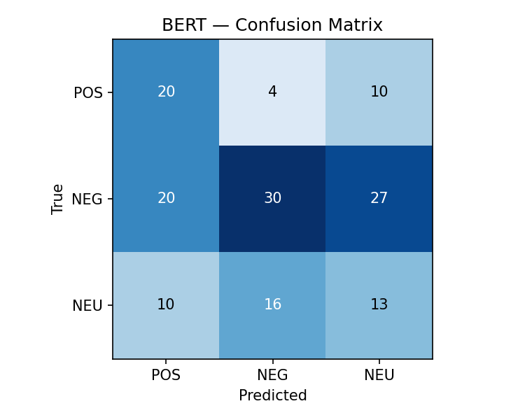

# Evaluation Results

Sample size: **150** comments

## BERT (pysentimiento)

- Accuracy: 0.420 (42.0%)
- F1 (weighted): 0.426
- F1 (macro): 0.414
- Precision (macro): 0.420
- Recall (macro): 0.437

### Classification Report

```
              precision    recall  f1-score   support

         POS      0.400     0.588     0.476        34
         NEG      0.600     0.390     0.472        77
         NEU      0.260     0.333     0.292        39

    accuracy                          0.420       150
   macro avg      0.420     0.437     0.414       150
weighted avg      0.466     0.420     0.426       150

```



## Error Analysis

Top 10 BERT misclassifications:

| # | Language | True | Predicted | Text |
|---|----------|------|-----------|------|
| 1 | es | POS | POS | Que decepción con Brasil desde que bajo su Nivel ya no a vuelto hacer la poderosa Seleccion ahora cualquier seleccion la |
| 2 | es | NEG | NEU | vi partido de México y sufrió para ganarle un Sudáfrica con dos hombres menos y aún Sudáfrica ranking 81 |
| 3 | es | NEG | POS | ​-Gregorio-Casasen juego marruecos es campeón, se nota que no viste el partido y hablas ... |
| 4 | en | NEG | NEG | I bite: There are approx 125,000 Curaçaoans. Let's math. |
| 5 | es | NEG | NEU | No sirve para nada saquen a este señor atrasado |
| 6 | es | NEU | POS | Porfin, le tomo 3 mundiales a telemundo para subir buenos resumenes, porque antes rusia y catar parecian videos de tik t |
| 7 | en | NEG | NEG | Dutch players play dirty . |
| 8 | en | NEG | NEU | How is this a comeback ? |
| 9 | es | NEU | NEU | Como siempre, argentina juega con 12 😂 |
| 10 | es | POS | POS | Kylian mbappe el mejor jugador del Mundo con mucha diferencia 🐐💯⚽ |
